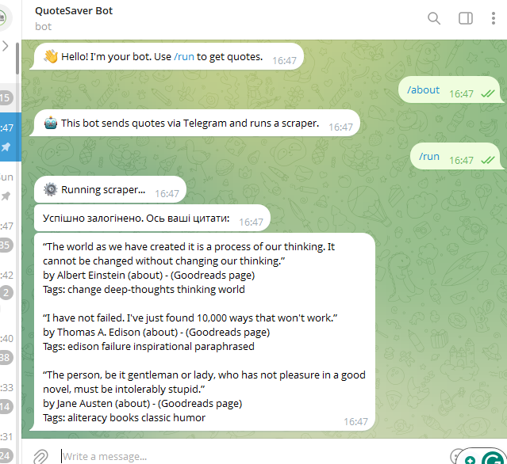

# Chat Saver


## Description
A Python project with two bots: one saves photos from WhatsApp chats, the other sends random quotes in Telegram on command.


## Technologies Used
- Python
- FastAPI
- Selenium
- Logging


## Features
- WhatsApp photo receiving and saving.
- Telegram bot with commands.
- Selenium script for quotes.


## Setup
To install the project locally on your computer, execute the following commands in a terminal:
```bash
git clone https://github.com/Illya-Maznitskiy/chat-saver.git
cd chat-saver
python -m venv venv
venv\Scripts\activate (on Windows)
source venv/bin/activate (on macOS)
pip install -r requirements.txt
```


## Create Your Telegram Bot
1. Use BotFather on Telegram to create your bot.
2. Copy the bot token after creating your bot.
3. Create a .env file by copying [.env.example](.env.example).
4. Paste your Telegram bot token into the .env file.

Watch this [video tutorial](https://www.youtube.com/watch?app=desktop&v=UQrcOj63S2o) on how to create a Telegram bot.


## Tests
You can run flake8 linter using the following commands:
```bash
flake8
```


## Run the project
```bash
python -m main
```


## Screenshot
### Logging


### Telegram Bot


